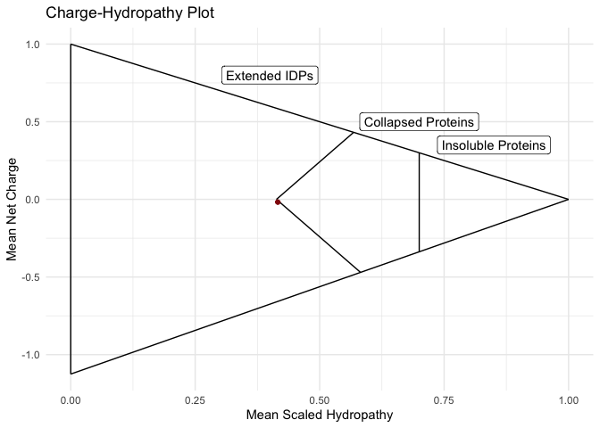
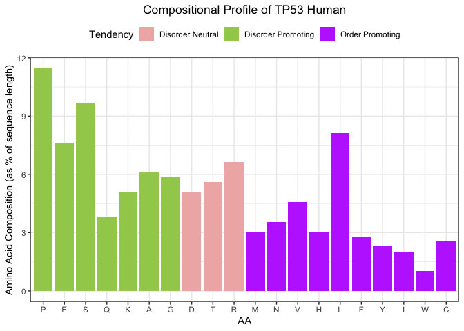
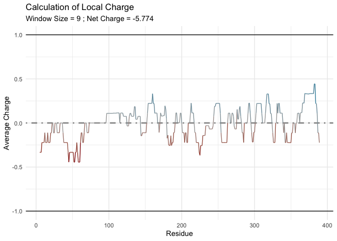
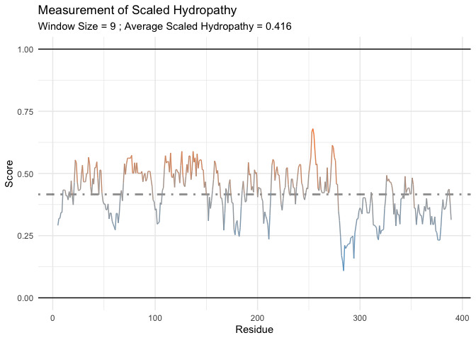
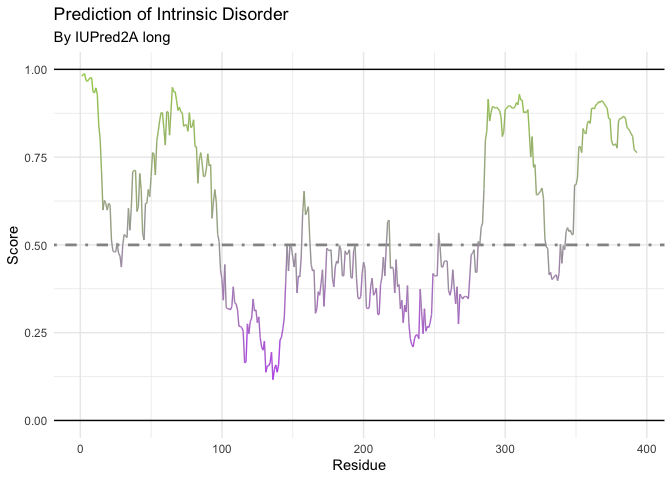

<!-- README.md is generated from README.Rmd. Please edit that file -->

# idpr

Overall, ‘idpr’ aims to integrate tools for the computational analysis
of intrinsically disordered proteins within R. This package is used to
identify known characteristics of IDPs within a sequence of interest
with easily reported and dynamic results. Additionally, this package
also includes tools for IDP-based sequence analysis to be used in
conjunction with other R packages.

**Please Refer to idpr-vignette.Rmd file for a detailed introduction to
the** **idpr package.**

Links to the vignettes found at the [Bioconductor landing page
(here)](https://doi.org/doi:10.18129/B9.bioc.idpr)

## Installation

You can install the stable release version version from
[Bioconductor](https://doi.org/doi:10.18129/B9.bioc.idpr) with:

``` r
if (!requireNamespace("BiocManager", quietly = TRUE))
    install.packages("BiocManager")

BiocManager::install("idpr")
```

Additionally, you can install the development version from
[Bioconductor](https://bioconductor.org/packages/devel/bioc/html/idpr.html)
with:

``` r
if (!requireNamespace("BiocManager", quietly = TRUE))
    install.packages("BiocManager")

# The following initializes usage of Bioc devel
BiocManager::install(version='devel')
```

Or you can install the most recent development version from
[GitHub](https://github.com/wmm27/idpr) with:

``` r
# install.packages("devtools") #if not already installed
devtools::install_github("wmm27/idpr")
```

## Example

This is a basic example to quickly profile your protein of interest:

``` r
library(idpr)

P53_HUMAN <- TP53Sequences[2] #Getting a pre-loaded sequence from idpr
print(P53_HUMAN)
#>                                                                                                                                                                                                                                                                                                                                                                                            P04637|P53_HUMAN 
#> "MEEPQSDPSVEPPLSQETFSDLWKLLPENNVLSPLPSQAMDDLMLSPDDIEQWFTEDPGPDEAPRMPEAAPPVAPAPAAPTPAAPAPAPSWPLSSSVPSQKTYQGSYGFRLGFLHSGTAKSVTCTYSPALNKMFCQLAKTCPVQLWVDSTPPPGTRVRAMAIYKQSQHMTEVVRRCPHHERCSDSDGLAPPQHLIRVEGNLRVEYLDDRNTFRHSVVVPYEPPEVGSDCTTIHYNYMCNSSCMGGMNRRPILTIITLEDSSGNLLGRNSFEVRVCACPGRDRRTEEENLRKKGEPHHELPPGSTKRALPNNTSSSPQPKKKPLDGEYFTLQIRGRERFEMFRELNEALELKDAQAGKEPGGSRAHSSHLKSKKGQSTSRHKKLMFKTEGPDSD"

P53_ID <- "P04637" #Human TP53 UniProt ID

idprofile(sequence = P53_HUMAN, #Generates the Profile
          uniprotAccession = P53_ID)
#> [[1]]
```



    #> 
    #> [[2]]



    #> 
    #> [[3]]



    #> 
    #> [[4]]



    #> 
    #> [[5]]


    #> 
    #> [[6]]



**Please Refer to idpr-vignette.Rmd file for a detailed introduction to
the** **idpr package.** [Link to the Vignette
(here)](https://bioconductor.org/packages/release/bioc/vignettes/idpr/inst/doc/idpr-vignette.html)

## Appendix

### Package citation

``` r
citation("idpr")
#> 
#> To cite package 'idpr' in publications use:
#> 
#>   William M. McFadden and Judith L. Yanowitz (2020). idpr: Profiling
#>   and Analyzing Intrinsically Disordered Proteins in R. R package
#>   version 1.5.11.
#> 
#> A BibTeX entry for LaTeX users is
#> 
#>   @Manual{,
#>     title = {idpr: Profiling and Analyzing Intrinsically Disordered Proteins in R},
#>     author = {William M. McFadden and Judith L. Yanowitz},
#>     year = {2020},
#>     note = {R package version 1.5.11},
#>   }
```

### Additional Information

``` r
Sys.time()
#> [1] "2022-03-15 21:11:51 EDT"
Sys.Date()
#> [1] "2022-03-15"
R.version
#>                _                           
#> platform       x86_64-apple-darwin17.0     
#> arch           x86_64                      
#> os             darwin17.0                  
#> system         x86_64, darwin17.0          
#> status                                     
#> major          4                           
#> minor          1.3                         
#> year           2022                        
#> month          03                          
#> day            10                          
#> svn rev        81868                       
#> language       R                           
#> version.string R version 4.1.3 (2022-03-10)
#> nickname       One Push-Up
```
